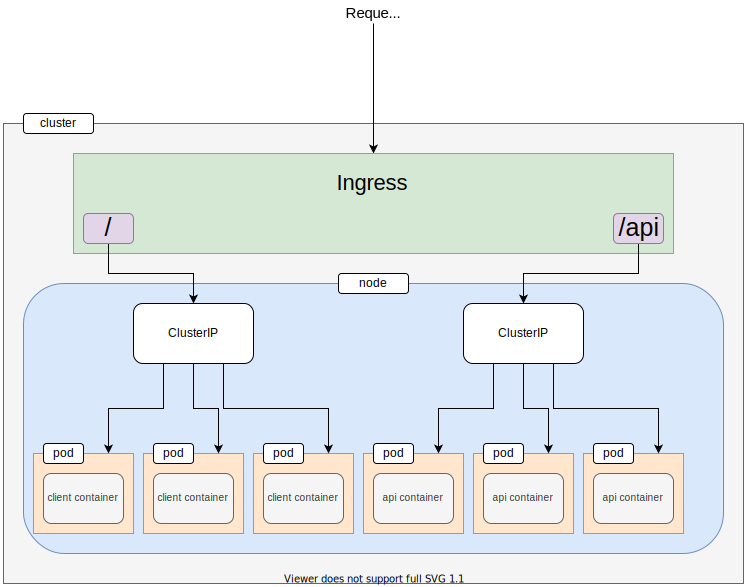
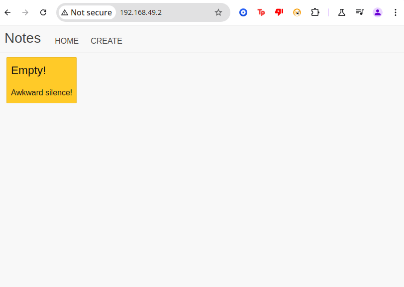

# Kubernetes Handbook: Comprehensive Guide

## Installing Kubernetes

To check your installed versions of Minikube and Kubernetes:
```
> minikube version
minikube version: v1.34.0
> kubectl version
Client Version: v1.32.0
Server Version: v1.31.0
```
Ensure both tools are installed and functioning correctly.

---

## Running Your First Pod

To create a simple pod:
```
kubectl run hello-kube --image=fhsinchy/hello-kube --port=80
```

### Verifying the Pod
To confirm the pod's status:
```
kubectl get pod
```
Sample output:
```
NAME         READY   STATUS             RESTARTS   AGE
hello-kube   0/1     ImagePullBackOff   0          7m
```
- If `STATUS` is `ImagePullBackOff`, inspect the pod details:
```
kubectl describe pod hello-kube
```
This can help diagnose issues like incorrect image paths. To fix these issues, delete and recreate the pod:
```
kubectl delete pod hello-kube
kubectl run hello-kube --image=fhsinchy/hello-kube --port=80
```

---

## Exposing the Pod with a Service

Pods are not externally accessible by default. To expose them:
```
kubectl expose pod hello-kube --type=LoadBalancer --port=80
```
This creates a LoadBalancer service, which provides an external endpoint.

### Checking the Service
To verify the service:
```
kubectl get service
```
Example output:
```
NAME         TYPE           CLUSTER-IP      EXTERNAL-IP   PORT(S)        AGE
hello-kube   LoadBalancer   10.97.178.216   <pending>     80:30287/TCP   2m
```
- `PORT(S)`: Exposes port 80 externally and forwards traffic to the pod's internal port 80.
- `EXTERNAL-IP`: If `<pending>`, use Minikube's tunneling feature:
```
minikube tunnel
```

### Accessing the Service
To open the application in your browser:
```
minikube service hello-kube
```
This outputs a URL like `http://192.168.49.2:30287` for direct access.

---

## Kubernetes Architecture Overview

### Key Components
- **Node:** A physical or virtual machine in the cluster. Minikube uses a single node for both control plane and worker roles.
- **Cluster:** A collection of nodes communicating over a shared network.

### Control Plane and Node Communication
1. **Control Plane Components:**
   - **Kube-API Server:** Acts as the entry point for all Kubernetes commands and API requests. It validates requests and updates the desired state in `etcd`.
   - **etcd:** A distributed key-value store that serves as the backing store for all cluster data. It holds the desired and current state of the cluster.
   - **Scheduler:** Assigns pods to nodes based on resource availability, taints, and tolerations.
   - **Controller Manager:** Ensures that the cluster matches its desired state by monitoring and reconciling objects like pods and services.

2. **Node Components:**
   - **Kubelet:** A primary agent running on every node. It communicates with the API server to:
     - Pull container images from a container registry.
     - Start and stop containers as needed.
     - Report the node and pod status back to the API server.
   - **Container Runtime:** Runs containers on the node (e.g., Docker or containerd).
   - **Kube-Proxy:** Manages network rules on each node to allow communication between services and pods.

### Workflow: How a Pod Gets Created
1. **User Command:** You run a command like `kubectl run` or apply a YAML manifest. This request is sent to the Kube-API server.
2. **API Server and etcd:** The API server validates the request and records the desired state in `etcd`.
3. **Scheduler:** The scheduler reads the desired state from `etcd` and assigns the pod to a suitable node.
4. **Kubelet on Node:** The kubelet on the assigned node:
   - Pulls the container image specified in the pod's definition.
   - Starts the container(s) using the container runtime.
   - Continuously reports the pod's status (e.g., Running, Pending) back to the API server.
5. **Service Discovery:** If a service is associated with the pod, the Kube-Proxy ensures the pod is discoverable through the cluster's DNS.

### Core Objects
1. **Pods**:
   - Encapsulate one or more tightly coupled containers sharing resources and a lifecycle.
   - Example configuration:
```
apiVersion: v1
kind: Pod
metadata:
  name: example-pod
spec:
  containers:
    - name: app-container
      image: nginx
      ports:
        - containerPort: 80
```

2. **Services**:
   - Group pods and provide stable network endpoints.
   - Example LoadBalancer service configuration:
```
apiVersion: v1
kind: Service
metadata:
  name: example-service
spec:
  type: LoadBalancer
  ports:
    - port: 80
      targetPort: 80
  selector:
    app: nginx
```

---

## Declarative Deployment

Instead of manually issuing commands, define your resources in YAML configuration files for consistency.

### Explanation of YAML Fields

#### Example 1: Pod Configuration

```
apiVersion: v1
kind: Pod
metadata:
  name: hello-kube-pod
  labels:
    component: web
spec:
  containers:
    - name: hello-kube
      image: fhsinchy/hello-kube
      ports:
        - containerPort: 80
```

**Key Fields Explained:**

1. **apiVersion**: Specifies the API version of Kubernetes to use. Here, `v1` indicates the first stable version of the API.

2. **kind**: Defines the type of Kubernetes object being created. `Pod` is the smallest deployable unit in Kubernetes.

3. **metadata**:
   - **name**: A unique name for the Pod (`hello-kube-pod`).
   - **labels**: Key-value pairs used to organize and select Kubernetes objects. Here, `component: web` is a label.

4. **spec**: Describes the desired state of the Pod.
   - **containers**: A list of containers to run in the Pod. Each container has:
     - **name**: A unique name for the container within the Pod (`hello-kube`).
     - **image**: The container image to use (`fhsinchy/hello-kube`).
     - **ports**: Ports exposed by the container.
       - **containerPort**: The port number exposed by the container (`80`).

#### Example 2: LoadBalancer Service Configuration

```
apiVersion: v1
kind: Service
metadata:
  name: hello-kube-load-balancer-service
spec:
  type: LoadBalancer
  ports:
    - port: 80
      targetPort: 80
  selector:
    component: web
```

**Key Fields Explained:**

1. **apiVersion**: Specifies the API version of Kubernetes to use. Here, `v1` is used for stable APIs.

2. **kind**: Defines the type of Kubernetes object. In this case, `Service` is used to expose a set of Pods to external or internal traffic.

3. **metadata**:
   - **name**: A unique name for the Service (`hello-kube-load-balancer-service`).

4. **spec**: Describes the desired state of the Service.
   - **type**: The type of Service. `LoadBalancer` creates an external load balancer to distribute traffic.
   - **ports**:
     - **port**: The port number exposed by the Service (`80`).
     - **targetPort**: The port on the Pods to forward traffic to (`80`).
   - **selector**: Selects Pods to route traffic to based on labels. Here, it selects Pods with the label `component: web`.


To apply this configuration:
```
kubectl apply -f hello-kube-pod.yaml
```
#### Key fields Explained
1. **apiVersion**: Specifies the API version of Kubernetes to use. Here, v1 indicates the first stable version of the API.
2. **kind**: Defines the type of Kubernetes object being created. Pod is the smallest deployable unit in Kubernetes.
3. **metadata.name**: A unique name for the Pod (hello-kube-pod).
4. **metadata.labels**: Key-value pairs used to organize and select Kubernetes objects. Here, component: web is a label.
5. **spec**: Describes the desired state of the Pod.
6. **spec.containers**: A list of containers to run in the Pod. Each container has `name`, `image`
7. **name**: A unique name for the container within the Pod (hello-kube).
8. **image**: The container image to use (fhsinchy/hello-kube).
ports: Ports exposed by the container.

containerPort: The port number exposed by the container (80).

### Example 2: LoadBalancer Service Configuration
Create a file named `hello-kube-load-balancer-service.yaml`:
```
apiVersion: v1
kind: Service
metadata:
  name: hello-kube-load-balancer-service
spec:
  type: LoadBalancer
  ports:
    - port: 80
      targetPort: 80
  selector:
    component: web
```
Apply the configuration:
```
kubectl apply -f hello-kube-load-balancer-service.yaml
```

---

## Managing Kubernetes Resources

### Deleting Resources
To remove specific resources:
```
kubectl delete pod <pod-name>
kubectl delete service <service-name>
```
To delete all resources of a type:
```
kubectl delete <resource-type> --all
```
Examples:
```
kubectl delete pod --all
kubectl delete service --all
```

### Inspecting Events and Logs
To view events related to a pod:
```
kubectl describe pod <pod-name>
```
To see logs of a running pod:
```
kubectl logs <pod-name>
```

---

## Using the Kubernetes Dashboard

Launch the graphical UI to manage your cluster:
```
minikube dashboard
```
This opens a browser-based dashboard for managing Kubernetes resources visually.

---

## Working with Multi-Container Applications
* The application you will be working with is a simple express notes API with full CRUD functionality.
  * CRUD: Create, Read, Update, Delete
### Requirements
* The API uses PostgresSQL as its database system; 
  * Deploy the application but also setup internal networking between the application and database
### Notes
* The application source code resides inside the `notes-api/api` directory, as well as a `Dockerfile`
* The `notes-api/postgres` directory has custom database with a `Dockerfile`
  * The table necessary for the db is in  `notes-api/postgres/docker-entrypoint-initdb.d/notes.sql` initialization

* The docker-compose.yaml shows the two containers to be run and the setup.

### Deployment Plan
In this project, you will create three instances of the notes-api
    * These three instances will be exposed outside the cluster using a `LoadBalancer`

## Replication Controllers, Replica Sets, and Deployments
1. **ReplicationController**: allows you to easily create multiple replicas very easily
    * Once the desired number of replicas are created, the controller ensures it stays in that state
    * If you want to lower the number of replicas, this controller will take actions immediately and get rid of the extra pod
2. **ReplicaSet**: has taken place of `ReplicationController` in newer API's


## Replication Controllers, Replica Sets, and Deployments

1. ReplicationController
    - Ensures a specified number of pod replicas are running at all times.
    - Simplifies the creation and management of multiple replicas.
    - Automatically adjusts the number of pods to match the desired state:
    - If the number of replicas is reduced, it terminates extra pods.

2. ReplicaSet
    - Replaces `ReplicationController` in newer Kubernetes APIs.
    - Provides the same core functionality as `ReplicationController`, with additional features and better integration with modern Kubernetes tools.
3. Deployment
    - Built on top of ReplicaSets to simplify management and version control of applications.
    - Supports rolling updates, rollbacks, and declarative updates to application configurations.
    - Provides a higher-level abstraction for managing application deployments effectively.

## Creating Your First Deployment
Create a file named `notes-api/k8s/api-deployment.yaml`
```
apiVersion: apps/v1
kind: Deployment
metadata:
  name: api-deployment
spec:
  replicas: 3
  selector:
    matchLabels:
        component: api
  templates:
    metadata: 
        labels:
            components: api
  
```
Apply the configuration:
```
kubectl apply -f notes-api/k8s/api-deployment.yaml
```

**Key Fields Explained:**
1. **spec.replicas**: defines the number of running replicas of that pod
2. **spec.selector.matchLabels**: is where you let deployment component where to find the pod to control
3. **spec.template**: is the template for configuring a pod, its almost the same as previous configurations.


* Lets see if the pods (replicas) are running:
```shell
> kubectl get pod
NAME                              READY   STATUS              RESTARTS   AGE
api-deployment-867cb78944-5qwcg   0/1     ContainerCreating   0          69s
api-deployment-867cb78944-cnnnt   0/1     ContainerCreating   0          69s
api-deployment-867cb78944-qnptt   0/1     ContainerCreating   0          69s
```

* How can I get more information for my none of the last three pods are not in STATUS=Running
```shell
> kubectl describe pod api-deployment-867cb78944-5qwcg
Name:             api-deployment-867cb78944-5qwcg
Namespace:        default
Priority:         0
Service Account:  default
Node:             minikube/192.168.49.2
Start Time:       Thu, 19 Dec 2024 18:21:57 -0800
Labels:           component=api
                  pod-template-hash=867cb78944
Annotations:      <none>
Status:           Pending
IP:               
IPs:              <none>
Controlled By:    ReplicaSet/api-deployment-867cb78944
Containers:
  api:
    Container ID:   
    Image:          fhsinchy/notes-api
    Image ID:       
    Port:           3000/TCP
    Host Port:      0/TCP
    State:          Waiting
      Reason:       ContainerCreating
    Ready:          False
    Restart Count:  0
    Environment:    <none>
    Mounts:
      /var/run/secrets/kubernetes.io/serviceaccount from kube-api-access-w62b2 (ro)
Conditions:
  Type                        Status
  PodReadyToStartContainers   False 
  Initialized                 True 
  Ready                       False 
  ContainersReady             False 
  PodScheduled                True 
Volumes:
  kube-api-access-w62b2:
    Type:                    Projected (a volume that contains injected data from multiple sources)
    TokenExpirationSeconds:  3607
    ConfigMapName:           kube-root-ca.crt
    ConfigMapOptional:       <nil>
    DownwardAPI:             true
QoS Class:                   BestEffort
Node-Selectors:              <none>
Tolerations:                 node.kubernetes.io/not-ready:NoExecute op=Exists for 300s
                             node.kubernetes.io/unreachable:NoExecute op=Exists for 300s
Events:
  Type    Reason     Age    From               Message
  ----    ------     ----   ----               -------
  Normal  Scheduled  3m23s  default-scheduler  Successfully assigned default/api-deployment-867cb78944-5qwcg to minikube
  Normal  Pulling    3m22s  kubelet            Pulling image "fhsinchy/notes-api"
> kubectl describe pod api-deployment-867cb78944-5qwcg
Name:             api-deployment-867cb78944-5qwcg
Namespace:        default
Priority:         0
Service Account:  default
Node:             minikube/192.168.49.2
Start Time:       Thu, 19 Dec 2024 18:21:57 -0800
Labels:           component=api
                  pod-template-hash=867cb78944
Annotations:      <none>
Status:           Running
IP:               10.244.0.17
IPs:
  IP:           10.244.0.17
Controlled By:  ReplicaSet/api-deployment-867cb78944
Containers:
  api:
    Container ID:   docker://a6e3d5302f9802368835c8db05d72cdad7d7cea68f5dfe6627213e6f2c64ccc3
    Image:          fhsinchy/notes-api
    Image ID:       docker-pullable://fhsinchy/notes-api@sha256:4c715c7ce3ad3693c002fad5e7e7b70d5c20794a15dbfa27945376af3f3bb78c
    Port:           3000/TCP
    Host Port:      0/TCP
    State:          Terminated
      Reason:       Error
      Exit Code:    1
      Started:      Thu, 19 Dec 2024 18:26:13 -0800
      Finished:     Thu, 19 Dec 2024 18:26:14 -0800
    Last State:     Terminated
      Reason:       Error
      Exit Code:    1
      Started:      Thu, 19 Dec 2024 18:25:58 -0800
      Finished:     Thu, 19 Dec 2024 18:25:58 -0800
    Ready:          False
    Restart Count:  2
    Environment:    <none>
    Mounts:
      /var/run/secrets/kubernetes.io/serviceaccount from kube-api-access-w62b2 (ro)
Conditions:
  Type                        Status
  PodReadyToStartContainers   True 
  Initialized                 True 
  Ready                       False 
  ContainersReady             False 
  PodScheduled                True 
Volumes:
  kube-api-access-w62b2:
    Type:                    Projected (a volume that contains injected data from multiple sources)
    TokenExpirationSeconds:  3607
    ConfigMapName:           kube-root-ca.crt
    ConfigMapOptional:       <nil>
    DownwardAPI:             true
QoS Class:                   BestEffort
Node-Selectors:              <none>
Tolerations:                 node.kubernetes.io/not-ready:NoExecute op=Exists for 300s
                             node.kubernetes.io/unreachable:NoExecute op=Exists for 300s
Events:
  Type     Reason     Age                  From               Message
  ----     ------     ----                 ----               -------
  Normal   Scheduled  4m29s                default-scheduler  Successfully assigned default/api-deployment-867cb78944-5qwcg to minikube
  Normal   Pulled     32s                  kubelet            Successfully pulled image "fhsinchy/notes-api" in 3m56.955s (3m56.955s including waiting). Image size: 971242718 bytes.
  Normal   Pulled     29s                  kubelet            Successfully pulled image "fhsinchy/notes-api" in 919ms (1.226s including waiting). Image size: 971242718 bytes.
  Normal   Pulling    15s (x3 over 4m29s)  kubelet            Pulling image "fhsinchy/notes-api"
  Normal   Created    14s (x3 over 32s)    kubelet            Created container api
  Normal   Started    14s (x3 over 32s)    kubelet            Started container api
  Normal   Pulled     14s                  kubelet            Successfully pulled image "fhsinchy/notes-api" in 948ms (948ms including waiting). Image size: 971242718 bytes.
  Warning  BackOff    12s (x3 over 28s)    kubelet            Back-off restarting failed container api in pod api-deployment-867cb78944-5qwcg_default(c16e1576-98cb-43fa-ab8b-ff5fd90db496)


```

* Events==Warning && Reason=BackOff: it looks like we forgot the environmental variables to connect to the database.

## Getting Container Logs from Pods
* Lets see whats really going wrong inside the containers:
```shell
> kubectl logs api-deployment-867cb78944-5qwcg

> api@1.0.0 start /usr/app
> cross-env NODE_ENV=production node bin/www

/usr/app/node_modules/knex/lib/client.js:55
    throw new Error(`knex: Required configuration option 'client' is missing.`);
    ^

Error: knex: Required configuration option 'client' is missing.
    at new Client (/usr/app/node_modules/knex/lib/client.js:55:11)
    at Knex (/usr/app/node_modules/knex/lib/knex.js:53:28)
    at Object.<anonymous> (/usr/app/services/knex.js:5:18)
    at Module._compile (internal/modules/cjs/loader.js:1138:30)
    at Object.Module._extensions..js (internal/modules/cjs/loader.js:1158:10)
    at Module.load (internal/modules/cjs/loader.js:986:32)
    at Function.Module._load (internal/modules/cjs/loader.js:879:14)
    at Module.require (internal/modules/cjs/loader.js:1026:19)
    at require (internal/modules/cjs/helpers.js:72:18)
    at Object.<anonymous> (/usr/app/services/index.js:1:14)
npm ERR! code ELIFECYCLE
npm ERR! errno 1
npm ERR! api@1.0.0 start: `cross-env NODE_ENV=production node bin/www`
npm ERR! Exit status 1
npm ERR! 
npm ERR! Failed at the api@1.0.0 start script.
npm ERR! This is probably not a problem with npm. There is likely additional logging output above.

npm ERR! A complete log of this run can be found in:
npm ERR!     /root/.npm/_logs/2024-12-20T02_29_02_337Z-debug.log


```
* Just updating the configuration file for the api-deployment.yaml will fix this:

```yaml
apiVersion: apps/v1
kind: Deployment
metadata:
  name: api-deployment
spec:
  replicas: 3
  selector:
    matchLabels:
      component: api
  template:
    metadata:
      labels:
        component: api
    spec:
      containers:
        - name: api
          image: fhsinchy/notes-api
          ports:
            - containerPort: 3000

          # these are the environment variables
          env:
            - name: DB_CONNECTION
              value: pg
```

* The `DB_CONNETION` indicates that the application is using a `PostgresSQL` database

Apply the configuration:
```
> kubectl apply -f notes-api/k8s/api-deployment.yaml
deployment.apps/api-deployment configured

> kubectl get deployment
NAME                  READY   UP-TO-DATE   AVAILABLE   AGE
api-deployment        3/3     3            3           17h

> kubectl get pod
NAME                                   READY   STATUS    RESTARTS   AGE
api-deployment-74c7d9dd8b-gp66k        1/1     Running   0          17h
api-deployment-74c7d9dd8b-pggzd        1/1     Running   0          17h
api-deployment-74c7d9dd8b-tbqgz        1/1     Running   0          17h

```

## Creating the Database Deployment

* The next step for this multi-container application is to write a configuration for the database instance

Create a file named `notes-api/k8s/postgres-deployment.yaml`
```
apiVersion: apps/v1
kind: Deployment
metadata:
  name: posgres-deployment
spec:
  replicas: 1
  selector:
    matchLabels:
        component: postgres
  templates:
    metadata: 
        labels:
            components: postgres
    spec:
        containers:
            - name: postgres
              image: fhsinchy/notes-postgres
              ports:
                - containerPort: 5432
              env:
                - name: POSTGRES_PASSWORD
                  value: 63eaQB9wtLqmNBpg
                - name: POSTGRES_DB
                  value: notesdb
```
* `PostgeSQL` runs on the port `5432` by default
* `POSTGRES_PASSWORD` variable is required for running the `postgres` container
  * This password will also be used for connecting to this database by the API

Apply the configuration:
```shell
> kubectl apply -f notes-api/k8s/postgres-deployment.yaml
deployment.apps/postgres-deployment created

> kubectl get deployment
NAME                  READY   UP-TO-DATE   AVAILABLE   AGE
api-deployment        3/3     3            3           18h
postgres-deployment   1/1     1            1           17h

> kubectl get pod
NAME                                   READY   STATUS    RESTARTS   AGE
api-deployment-74c7d9dd8b-gp66k        1/1     Running   0          17h
api-deployment-74c7d9dd8b-pggzd        1/1     Running   0          17h
api-deployment-74c7d9dd8b-tbqgz        1/1     Running   0          17h
postgres-deployment-6fbfd88758-6cv96   1/1     Running   0          17h

```

### Problem with PostgreSQL Storage
* If the pod in the postgres-deployment fails, the database data is lost.
  * This happens because most databases use the container's local filesystem to store data, which is ephemeral.
* To prevent data loss, Kubernetes offers the PersistentVolume subsystem. 
  * This provides an abstraction layer for storage, separating how storage is provisioned from how it is consumed by pods.

## Persistent Volumes and Persistent Volume Claims
**PersistentVolume(PV)**: is a piece of storage in the cluster that has been provisioned by an admin or dynamically provisioned using a `StorageClass`
    - It's a resource in the cluster just like a node is a cluster resource.

Create a new file named `notes-api/k8s/database-persisitent-volume.yaml`
```yaml
apiVersion: v1
kind: PersistentVolume
metadata:
  name: database-persistent-volume
spec:
  storageClassName: manual
  capacity:
    storage: 5Gi
  accessModes:
    - ReadWriteOnce
  hostPath:
    path: "/mnt/data"
```
**Key Fields Explained:**
1. **spec.storageClassName**: 
    - Defines the `StorageCLass` to associate with the volume
    - `manual` indicates that the storage is statically provisioned, meaning you (the user) mange the storage's lifecycle and capacity outside of kubernetes.
    - if omitted, the default `StorageClass` in the cluster will be used.
2. **spec.capacity.storage**:
    - Specifies the storage capacity of the volume
    - The format is `<size><unit>`, where valid units include `Mi` (mebibytes), `Gi` (gigibytes), Ti` (tebibytes), etc
    - In this case, the Volume is allocated 5GiB of storage
3. **spec.accessModes**: Defines how the volume can be accessed. Common values are:
   1. `ReadWriteOnce` (RWO): the volume can be mounted as read/write by only one node
   2. `ReadOnlyMany` (ROX): the volume can be mounted as read-only by multiple nodes
   3. `ReadWriteMany` (RWX): the volume can be mounted as read/write by multiple nodes

4. **spec.hostPath.path**:
    - Indicates that the volume is backed by a directory on the host node's filesystem
    - The value `/mnt/data` specifies the directory on the node where the data will be stored.

Apply the configuration:
```shell
> kubectl apply -f notes-api/k8s/database-persistent-volume.yaml
persistentvolume/database-persistent-volume created

> kubectl get persistentvolume
NAME                         CAPACITY   ACCESS MODES   RECLAIM POLICY   STATUS      CLAIM   STORAGECLASS   VOLUMEATTRIBUTESCLASS   REASON   AGE
database-persistent-volume   5Gi        RWO            Retain           Available           manual         <unset>                          15h

```
* Now that the persistent volume has been created, you need a way to let the postgres pod access it.
  * This is where a `PersistentVolumeClaim`(PVC) comes in

### Persistent Volume Claim
* A persistent volume claim is a request for storage by a pod.
  - Assume that in a cluster, you have quite a lot of volumes
  - This claim will define the characteristics that a volume must meet to be able to satisfy a pod's requirements

Create another new file called `notes-api/k8s/database-persistent-volume-claim.yaml`
```yaml
apiVersion: v1
kind: PersistentVolumeClaim
metadata:
  name: database-persistent-volume-claim
spec:
  storageClassName: manual
  accessModes:
    - ReadWriteOnce
  resources:
    requests:
      storage: 2Gi
```
**Key Fields Explained:**

1. **spec.storageClass**: 
    - Specifies the type of storage this claim is requesting
    - Any `PersistentVolume` (PV) with a matching `spec.storageClassName` (`manual`) is eligible to fulfill this claim
    - If multiple `PersistentVolumes`  with the `manual` class are available, Kubernetes will bind the PVC to any one of them that also satisfies the other requirements (e.g., access modes and size)
    - If no such `PersistentVolume` exists:
        * In clusters configured for dynamic provisioning, a new `PersistentVolume` might be created automatically
        * Otherwise, the PVC will remain unbound until an appropriate `PersistentVolume` is created
2. **spec.accessModes**:
    - Defines the access mode required by the claim. In this case, `ReadWriteOnce` (RWO) is requested, meaning:
      - The volume can be mounted as read/write by a single node
    - Kubernetes will select `PersistentVolume` that supports `ReadWriteOnce`
    - Example Scenario:
      -  One with `accessModes: ReadWriteMany`  (RWX, allowing multiple nodes to write simultaneously)
    - This PVC will be bound to the volume with `ReadWriteOnce`

3. **resources.requests.storage**
    - Specifies th minimum storage capacity required by the claim (2Gi in this example)
    - The PVC will bind to any `PersistentVolume` with a capacity of **at least** 2Gi
    - The `PersistentVolume` does not need to have exactly 2Gi of capacity ; it can have more:
      - **Example**:  if a `PersistentVolume` with a capacity of 5Gi exists and matches the other criteria, it will satisfy this claim

* Its time to apply this file.
  * there is one more thing to do after to connect it to the `postgres` config letting kubernetes that it is using external data sources
```shell
> kubectl apply -f notes-api/k8s/database-persistent-volume-claim.yaml
persistentvolumeclaim/database-persistent-volume-claim created
> kubectl get persistentvolumeclaim
NAME                               STATUS   VOLUME                       CAPACITY   ACCESS MODES   STORAGECLASS   VOLUMEATTRIBUTESCLASS   AGE
database-persistent-volume-claim   Bound    database-persistent-volume   5Gi        RWO            manual         <unset>                 66s

```
* Before, we get into allowing deployment or pod type to use these outside containers volumes, we have to talk about volumes more

### Dynamic provisioning of Persistent Volumes
* This topic is what if there isnt any persistent volumes previously provisioned.
  * In this case a persistent volume compatible with the claim will be provisioned automatically 

Lets see this in action:
```shell
> kubectl delete persistentvolumeclaim --all
persistentvolumeclaim "database-persistent-volume-claim" deleted
> kubectl delete persistentvolume --all
persistentvolume "database-persistent-volume" deleted
```

* From `notes-api/k8s/database-persistent-volume-claim.yaml`, took out `storageClassName: manual`

Now lets reapply this claim
```shell
> kubectl apply -f notes-api/k8s/database-persistent-volume-claim.yaml
persistentvolumeclaim/database-persistent-volume-claim created
> kubectl get persistentvolumeclaim
NAME                               STATUS   VOLUME                                     CAPACITY   ACCESS MODES   STORAGECLASS   VOLUMEATTRIBUTESCLASS   AGE
database-persistent-volume-claim   Bound    pvc-b073b3ee-e00b-487e-a459-06ad17744922   2Gi        RWO            standard       <unset>                 10s

```
* The above shows a dynamic way to get Persistent data from the node


### Connecting Volumes with Pods
* We left off in this multi-application project was to tie to the PV to the posgres pod 

Edit postgres-deployment.yaml
```yaml
apiVersion: apps/v1
kind: Deployment
metadata:
  name: postgres-deployment
spec:
  replicas: 1
  selector:
    matchLabels:
      component: postgres
  template:
    metadata:
      labels:
        component: postgres
    spec:
      # volume configuration for the pod
      volumes:
        - name: postgres-storage
          persistentVolumeClaim:
            claimName: database-persistent-volume-claim
      containers:
        - name: postgres
          image: fhsinchy/notes-postgres
          ports:
            - containerPort: 5432
          # volume mounting configuration for the container
          volumeMounts:
            - name: postgres-storage
              mountPath: /var/lib/postgresql/data
              subPath: postgres
          env:
            - name: POSTGRES_PASSWORD
              value: 63eaQB9wtLqmNBpg
            - name: POSTGRES_DB
              value: notesdb
```
**Key Fields Explained:**

1. **spec.volumes**:  contains necessary information for the pod to find the `PersistentVolumeClaim`, to reference
2. **spec.volumes.name**: can be any name, but will be ref in `spec.containers.volumeMounts.name`
3. **spec.volumes.persistentVolumeClaim.claimName**: has to match the `metadata.name` value from the claim configuration 
4. **spec.containers.volumeMounts**: contains information necessary for mount the volume inside the container
5. **spec.containers.volumeMounts.name**: has to match the value from `spec.volumes.name`
6. **spec.containers.volumeMounts.mountPath**: indicates the directory where this volume will be mounted
    - The default directory for data where the volume will be mounted /var/lib/postgresql/data
7. **spec.containers.volumeMounts.subPath**: indicates a directory will be created inside the volume itself.
    - The value of this will be used as a sub-dir of `PV` mount path
      - Example: lets just say `PV` uses `/mnt/data`, and `subPath=posgres`, a directory called `/mnt/data/posgres` will be created and linked on to `spec.containers.VolumeMounts.mountPath`


Now lets re-apply our changes from  `notes-api/k8s/postgres-deployment.yaml`
```shell
> kubectl apply -f notes-api/k8s/postgres-deployment.yaml
deployment.apps/postgres-deployment configured


```
## Why a PostgreSQL Service is Needed
* Directly exposing the PostgreSQL pod’s port to the external network is unnecessary and can create security risks.
* A **ClusterIP** Service provides internal access within the Kubernetes cluster without exposing the database externally.

Create a new file for postgres service called `notes-api/k8/postgres-cluster-ip-service.yaml`
```yaml
apiVersion: v1
kind: Service
metadata:
  name: postgres-cluster-ip-service
spec:
  type: ClusterIP
  selector:
    component: postgres
  ports:
    - port: 5432
      targetPort: 5432
```

## Why an NOTES-API Service is Needed
* Exposing the API to the outside world (outside the cluster)

Create a new file for api service called `notes-api/k8/api-load-balencer-service.yaml`
```yaml
apiVersion: v1
kind: Service
metadata:
  name: api-load-balancer-service
spec:
  type: LoadBalancer
  ports:
    - port: 3000
      targetPort: 3000
  selector:
    component: api
```

## The last thing to do for the multi-container Application
* You may have wondered where the data is for the notes-api needs to login or get the url for postgres connection

We the to edit `notes-api/k8s/api-deployment.yaml` and add the missing environment variables
```yaml
apiVersion: apps/v1
kind: Deployment
metadata:
  name: api-deployment
spec:
  replicas: 3
  selector:
    matchLabels:
      component: api
  template:
    metadata:
      labels:
        component: api
    spec:
      containers:
        - name: api
          image: fhsinchy/notes-api
          ports:
            - containerPort: 3000
          env:
            - name: DB_CONNECTION
              value: pg
            - name: DB_HOST
              value: postgres-cluster-ip-service
            - name: DB_PORT
              value: '5432'
            - name: DB_USER
              value: postgres
            - name: DB_DATABASE
              value: notesdb
            - name: DB_PASSWORD
              value: 63eaQB9wtLqmNBpg
```

**How It All Comes Together**
1. Database Connectivity:
    * The `NOTES-API` pods retrieve connection details (e.g., DB_HOST, DB_PORT, DB_USER, DB_PASSWORD) from environment variables defined in the deployment.
    * The DB_HOST points to the PostgreSQL service name (postgres-cluster-ip-service), allowing stable communication regardless of pod IP changes.
2. Exposing the API:
   * The api-load-balancer-service exposes the NOTES-API to external users via a load balancer.
   * Traffic to the service on port 3000 is routed to one of the NOTES-API pods.

3. Scaling:
   * The deployment specifies replicas: 3, ensuring that three NOTES-API pods are running. The service automatically load-balances traffic between these pods.

Now lets re-apply everything:
```shell
> kubectl apply -f notes-api/k8s
deployment.apps/api-deployment configured
service/api-load-balancer-service created
persistentvolumeclaim/database-persistent-volume-claim unchanged
persistentvolume/database-persistent-volume created
service/postgres-cluster-ip-service created
deployment.apps/postgres-deployment unchanged


> kubectl get deployments
NAME                  READY   UP-TO-DATE   AVAILABLE   AGE
api-deployment        3/3     3            3           29h
postgres-deployment   1/1     1            1           28h
> minikube service api-load-balancer-service
|-----------|---------------------------|-------------|---------------------------|
| NAMESPACE |           NAME            | TARGET PORT |            URL            |
|-----------|---------------------------|-------------|---------------------------|
| default   | api-load-balancer-service |        3000 | http://192.168.49.2:30220 |
|-----------|---------------------------|-------------|---------------------------|
🎉  Opening service default/api-load-balancer-service in default browser...
Opening in existing browser session.


```
* To actually interact with the API you will have to use postman etc

## Setting up NGINX Ingress Controllers
* The need for a Ingress controllers is that it will route outside traffic to certain `Services` based on its resources.
* The controller we will be using is [NGINX Ingress](https://github.com/kubernetes/ingress-nginx/blob/master/README.md)
* Ingress: Acts as the entry point and router for the application, listening on port 80 (default NGINX Ingress port).
* Path-Based Routing:
  - Requests to / (e.g., https://kube-notes.test/foo) are routed to the front-end service.
  - Requests to /api (e.g., https://kube-notes.test/api/foo) are routed to the back-end API service.
* Design Choice: Path-based routing is used instead of sub-domains to match the application’s design.

###  Take a look at nginx/production.conf
* Here is an example that might help us understand the NGINX Ingress Controller
```
upstream client {
    server client:8080;
}

upstream api {
    server api:3000;
}

server {
    location / {
        proxy_pass http://client;
    }

    location /api {
        rewrite /api/(.*) /$1 break;
        proxy_pass http://api;
    }
}
```
* This configuration defines Nginx as a reverse proxy that routes traffic to two backend services:
    1. Frontend (client): Handles requests to /.
    2. API (api): Handles requests to /api. The /api prefix is removed before forwarding to the backend.



* In this sub-section, we will hav eto write four new configuration files:
  1. `ClusterIP` configuration for the API deployment
  2. `Deployment` configuration for the front-end application
  3. `ClusterIP` configuration for the front-end application
  4. `Ingress` configuration for the routing

* Ingress Handling:
  - The Ingress will manage external traffic and routing for the API.
  - The API is no longer exposed directly to the outside world.
* ClusterIP Service:
  - The API is exposed internally within the cluster using a ClusterIP service.
  - This ensures secure and efficient internal communication.
* Configuration:
  - Builds on previous concepts.
  - Straightforward, requiring no additional explanation.
  
### Configuration Example: `api-cluster-ip-service.yaml`
```yaml
apiVersion: v1
kind: Service
metadata:
  name: api-cluster-ip-service
spec:
  type: ClusterIP
  selector:
    component: api
  ports:
    - port: 3000
      targetPort: 3000

```


### Configuration Example: `client-deployment.yaml`
```yaml
apiVersion: apps/v1
kind: Deployment
metadata:
  name: client-deployment
spec:
  replicas: 3
  selector:
    matchLabels:
      component: client
  template:
    metadata:
      labels:
        component: client
    spec:
      containers:
        - name: client
          image: fhsinchy/notes-client
          ports:
            - containerPort: 8080
          env:
            - name: VUE_APP_API_URL
              value: /api
```

**VUE_APP_API_URL**: Specifies the API endpoint for forwarding requests.
* These requests are routed through the Ingress, which directs them to the appropriate back-end API service.

### Configuration Example: `client-cluster-ip-service.yaml`
```yaml
apiVersion: v1
kind: Service
metadata:
  name: client-cluster-ip-service
spec:
  type: ClusterIP
  selector:
    component: client
  ports:
    - port: 8080
      targetPort: 8080
```

- **Functionality**:
  - Exposes port `8080` within the cluster, where the front-end application runs by default.


### Configuration Example: `ingress-service.yaml`
### Notes

#### **Ingress Configuration**
```yaml
apiVersion: networking.k8s.io/v1
kind: Ingress
metadata:
name: ingress-service
annotations:
  kubernetes.io/ingress.class: nginx
  nginx.ingress.kubernetes.io/rewrite-target: /$1
spec:
rules:
  - http:
      paths:
      - pathType: Prefix
        path: "/?(.*)"
        backend:
          service:
            name: client-cluster-ip-service
            port:
              number: 8080
      - pathType: Prefix
        path: "/api/?(.*)"
        backend:
          service:
            name: api-cluster-ip-service
            port:
              number: 3000
```

- **Ingress Basics**:
  - Acts as an entry point for routing HTTP traffic to different services within the cluster.
  - Handles path-based routing for requests.

- **Annotations**:
  - `kubernetes.io/ingress.class: nginx`: Specifies that this Ingress should be controlled by the NGINX Ingress Controller.
  - `nginx.ingress.kubernetes.io/rewrite-target: /$1`: Rewrites the URL paths using a simple regex pattern.

- **Rules**:
  - Defines routing paths within `spec.rules.http.paths`:
    - `/?(.*)` routes all requests to the **client-cluster-ip-service** on port `8080` (frontend).
    - `/api/?(.*)` routes all requests to the **api-cluster-ip-service** on port `3000` (backend API).

- **Regex Paths**:
  - `/?(.*)` and `/api/?(.*)`:
    - `?(.*)` captures the remaining path for routing.
    - Ensures that the correct service receives the request while preserving the URL format.

---

#### **Minikube Ingress Addon**
- **Enable Ingress**:
  - Run the following command to activate the NGINX Ingress addon in Minikube:
```bash
> minikube addons enable ingress
💡  ingress is an addon maintained by Kubernetes. For any concerns contact minikube on GitHub.
You can view the list of minikube maintainers at: https://github.com/kubernetes/minikube/blob/master/OWNERS
    ▪ Using image registry.k8s.io/ingress-nginx/kube-webhook-certgen:v1.4.3
    ▪ Using image registry.k8s.io/ingress-nginx/kube-webhook-certgen:v1.4.3
    ▪ Using image registry.k8s.io/ingress-nginx/controller:v1.11.2
🔎  Verifying ingress addon...
🌟  The 'ingress' addon is enabled
```

- **Disable Ingress**:
  - Use the following command to deactivate the addon:
    ```bash
    minikube addons disable ingress
    ```

---

#### **Notes for Best Practices**:
- **Ingress API Version**: The `apiVersion` might differ depending on your Kubernetes version (e.g., `extensions/v1` in older versions).
- **Official Docs**:
  - Always refer to the latest Kubernetes and NGINX documentation for updates on rewriting configurations or Ingress features.


## Apply all configuration files for `fullstack-notes-application`
```shell
> kubectl delete ingress --all
No resources found

> kubectl delete service --all
service "api-load-balancer-service" deleted
service "hello-kube-load-balancer-service" deleted
service "kubernetes" deleted
service "postgres-cluster-ip-service" deleted

> kubectl delete deployment --all
deployment.apps "api-deployment" deleted
deployment.apps "postgres-deployment" deleted

> kubectl delete persistentvolumeclaim --all
persistentvolumeclaim "database-persistent-volume-claim" deleted

```
* Now apply all the `fullstack-notes-application/k8s`
```shell
> kubectl apply -f fullstack-notes-application/k8s
service/api-cluster-ip-service unchanged
deployment.apps/api-deployment unchanged
service/client-cluster-ip-service unchanged
deployment.apps/client-deployment unchanged
persistentvolumeclaim/database-persistent-volume-claim unchanged
Warning: annotation "kubernetes.io/ingress.class" is deprecated, please use 'spec.ingressClassName' instead
Warning: path /?(.*) cannot be used with pathType Prefix
Warning: path /api/?(.*) cannot be used with pathType Prefix
ingress.networking.k8s.io/ingress-service created
service/postgres-cluster-ip-service unchanged
deployment.apps/postgres-deployment unchanged

```

* Now its time to see what our IP Address is
```shell
> kubectl get ingress

NAME              CLASS    HOSTS   ADDRESS        PORTS   AGE
ingress-service   <none>   *       192.168.49.2   80      101s
```
* Open up a browser enter `http://192.168.49.2`



* The `NGINX Ingress Controller` leverages Kubernetes `ConfigMaps`:
  * It stores and manage NGINX configurations, allowing you to customize and optimize behavior such as:
    1. load balancing
    2. caching, 
    3. SSL settings
  * Mastering its configuration unlocks powerful networking and traffic management capabilities for your Kubernetes cluster.
```shell
> kubectl get configmaps -n ingress-nginx
NAME                       DATA   AGE
ingress-nginx-controller   1      77m
kube-root-ca.crt           1      77m
tcp-services               0      77m
udp-services               0      77m
```

## Secrets and Config Maps in Kubernetes

