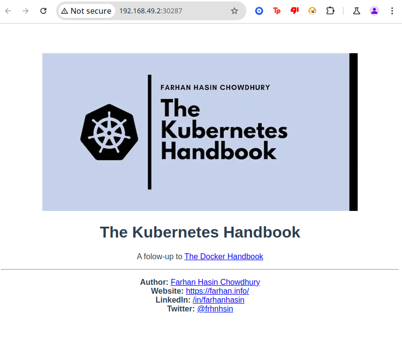
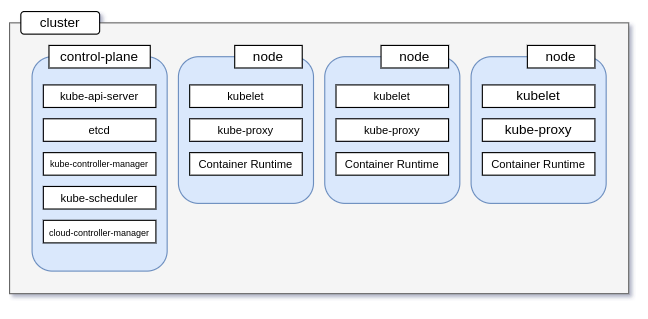
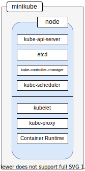
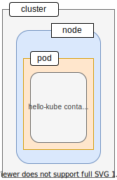
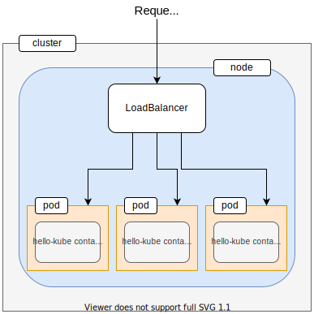
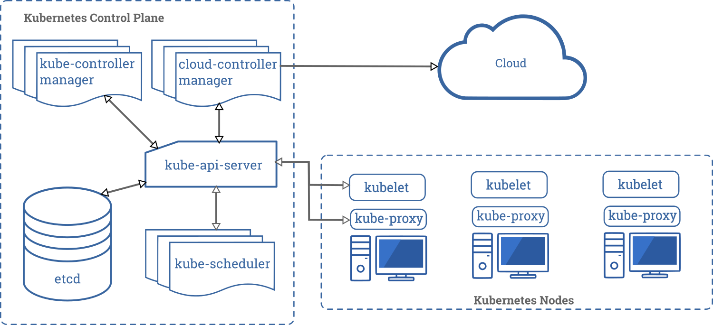

## Installing Kubernetes
```shell
> minikube version
minikube version: v1.34.0
commit: 210b148df93a80eb872ecbeb7e35281b3c582c61-dirty

> kubectl version
Client Version: v1.32.0
Kustomize Version: v5.5.0
Server Version: v1.31.0

```

## Hello World in Kubernetes

```shell
kubectl run hello-kube --image=fhsinchy/hello-kube --port=80

# pod/hello-kube created
```
* To make sure the pod has been created and is running,execute the following command:

```shell
> kubectl get pod
NAME                                 READY   STATUS             RESTARTS      AGE
hello-kube                           0/1     ImagePullBackOff   0             7m27s
mongo-deployment-77b4cbd6b-nbxch     1/1     Running            1 (10m ago)   3d22h
webapp-deployment-655ff6696b-nktq9   1/1     Running            1 (10m ago)   3d22h

```

* Note that the `STATUS=ImagePullBackOff` was looked into:

```shell
> kubectl describe pod hello-kube

Name:             hello-kube
Namespace:        default
Priority:         0
Service Account:  default
Node:             minikube/192.168.49.2
Start Time:       Thu, 19 Dec 2024 11:45:59 -0800
Labels:           run=hello-kube
Annotations:      <none>
Status:           Pending
IP:               10.244.0.12
IPs:
  IP:  10.244.0.12
Containers:
  hello-kube:
    Container ID:   
    Image:          fhsincy/hello-kube
    Image ID:       
    Port:           80/TCP
    Host Port:      0/TCP
    State:          Waiting
      Reason:       ImagePullBackOff
    Ready:          False
    Restart Count:  0
    Environment:    <none>
    Mounts:
      /var/run/secrets/kubernetes.io/serviceaccount from kube-api-access-9x77c (ro)
Conditions:
  Type                        Status
  PodReadyToStartContainers   True 
  Initialized                 True 
  Ready                       False 
  ContainersReady             False 
  PodScheduled                True 
Volumes:
  kube-api-access-9x77c:
    Type:                    Projected (a volume that contains injected data from multiple sources)
    TokenExpirationSeconds:  3607
    ConfigMapName:           kube-root-ca.crt
    ConfigMapOptional:       <nil>
    DownwardAPI:             true
QoS Class:                   BestEffort
Node-Selectors:              <none>
Tolerations:                 node.kubernetes.io/not-ready:NoExecute op=Exists for 300s
                             node.kubernetes.io/unreachable:NoExecute op=Exists for 300s
Events:
  Type     Reason     Age                From               Message
  ----     ------     ----               ----               -------
  Normal   Scheduled  88s                default-scheduler  Successfully assigned default/hello-kube to minikube
  Normal   Pulling    42s (x3 over 88s)  kubelet            Pulling image "fhsincy/hello-kube"
  Warning  Failed     41s (x3 over 87s)  kubelet            Failed to pull image "fhsincy/hello-kube": Error response from daemon: pull access denied for fhsincy/hello-kube, repository does not exist or may require 'docker login': denied: requested access to the resource is denied
  Warning  Failed     41s (x3 over 87s)  kubelet            Error: ErrImagePull
  Normal   BackOff    13s (x4 over 86s)  kubelet            Back-off pulling image "fhsincy/hello-kube"
  Warning  Failed     13s (x4 over 86s)  kubelet            Error: ImagePullBackOff


```

* The above was caused because the image path was wrong

```shell
> kubectl delete pod hello-kube

pod "hello-kube" deleted
> kubectl run hello-kube --image=fhsinchy/hello-kube --port=80
pod/hello-kube created

> kubectl get pod
NAME         READY   STATUS    RESTARTS   AGE
hello-kube   1/1     Running   0          21s

```

* Pods by default are inaccessible from outside the cluster.
  * To make them accessible, you have to expose them using a service:
```shell
> kubectl expose pod hello-kube --type=LoadBalancer --port 80
service/hello-kube exposed

```

* Lets make sure the load balancer service has been created successfully:

```shell
> kubectl get service
NAME         TYPE           CLUSTER-IP      EXTERNAL-IP   PORT(S)        AGE
hello-kube   LoadBalancer   10.97.178.216   <pending>     80:30287/TCP   91s
kubernetes   ClusterIP      10.96.0.1       <none>        443/TCP        3d22h

```

* Make sure tyou see the `hello-kube` service in the list
  * You have a pod running that is exposed, you can go ahead an access that:

```shell
> minikube service hello-kube
|-----------|------------|-------------|---------------------------|
| NAMESPACE |    NAME    | TARGET PORT |            URL            |
|-----------|------------|-------------|---------------------------|
| default   | hello-kube |          80 | http://192.168.49.2:30287 |
|-----------|------------|-------------|---------------------------|
🎉  Opening service default/hello-kube in default browser...
Opening in existing browser session.

```


## Kubernetes Architecture

* `node`: can either be a physical or a virtual machine with a given role.
* `cluster`: A collection of nodes using a shared network to communicate between each other



* In your local setup, minikube is a single node kubernetes cluster.
  * So instead of having multiple servers like in the diagram above `minikube` has only one that acts as both the control plane and the node



### Kubernetes Objects
#### Pods
* A `Pod` usually encapsulates one or more containers that are closely related sharing a life cycle and conumable resources.



#### Services
* A `Service` groups together a number of pods that perform the same function and presents them as a single entity.



## The Full Picture



* The first cmd that you ran was the `run` command:
```shell
kubectl run hello-kube --image=fhsinchy/hello-kube --port=80
```
* The `run` command is responsible for creating a new pod that runs the given image.
* Once you have issued this command, the following sets of events occur inside the kubernetes cluster:
  1. The `kube-api-server` component receives the request, validates it and process it
  2. The `kube-api-server` then communicates with the `kubelet` component on the node and provides the instructions necessary for creating the pod
  3. The `kubelet` component starts working on making the pod up and running and also keeps the state information updated in the `etcd` store

### Getting Rid of Kubernetes Resources
* The only way to get rid of a Kubernetes resource is to delete it

```shell
> kubectl delete pod hello-kube
pod "hello-kube" deleted
> kubectl get svc
NAME         TYPE           CLUSTER-IP      EXTERNAL-IP   PORT(S)        AGE
hello-kube   LoadBalancer   10.97.178.216   <pending>     80:30287/TCP   30m
kubernetes   ClusterIP      10.96.0.1       <none>        443/TCP        3d22h
> kubectl delete service hello-kube
service "hello-kube" deleted

```

* To delete all the objects of a resource, you can use the following syntax
```shell
kubectl delete <object type> --all

```
* kubectl delete pod --all and kubectl delete service --all respectively.

## Declarative Deployment Approach
* The `declarative approach`, lets kubernetes know the state you deisre your servers to be in and kubernetes figures out a way to implement that.

### Hello-Kube - Declarative

* Inside hello-kube/ directory for the application there is a Dockerfile for building the image.

```shell
> tree hello-kube
hello-kube
├── Dockerfile
├── index.html
├── package.json
├── public
│   └── favicon.ico
└── src
    ├── App.vue
    ├── assets
    │   └── kubernetes-handbook-github.webp
    ├── components
    │   └── HelloKube.vue
    ├── index.css
    └── main.js

5 directories, 9 files

```
### Writing your first set of configurations
* In the declarative approach, instead of issuing commands in the terminal, you write down the necessary configuration in a YAML file and feed that to kubernetes
* k8s is short for k(ubernete = 8 character)s

#### Declarative approach creating pod - hello-kube

**hello-kube/k8s/hello-kube-pod.yaml**
```yaml
apiVersion: v1
kind: Pod
metadata:
  name: hello-kube-pod
  labels:
    component: web
spec:
  containers:
    - name: hello-kube
      image: fhsinchy/hello-kube
      ports:
        - containerPort: 80
```
**apiVersion**: which version of the Kubernetes API you are using to create this object.
    
    * This value may change depending on the kind of object you are creating
**kind**: What kind of object you want to create?

    * There are many objects in kubernetes, in the above its `Pod` object

**metadata**: data that hleps uniqueley identify the object.
  * Under this field you can have information like `name`, `labels`, `annotation`, etc
  * Fields(metadata):
    * `metadata.name`: string will show up on the terminal & will be used in kubectl commands.
    * `metadata.labels`: does not have to be `components: web` it can be any set of key-value.
    
**spec**: contains the state you desire for the object.
  * Fields(spec):
    * `spec.containers`: contains information about the containers that will run inside this `Pod`
    * `spec.containers.name`: value is what will the container runtime inside the node will assigning to the newly created container
    * `spec.containers.image`: is the container image to be used for creating this container
    * `spec.containers.ports`: holds configuration regarding various ports configuration
      * containerPort: 80 - indicates that you want to expose port 80 from the container.

* To feed these configuration files to kubernetes please use `apply`:
```shell
kubectl apply -f <configuration file>
```

* To feed a configuration file named `hello-kube-pod.yaml`, the command as follows:
```shell
> kubectl apply -f k8s/hello-kube-pod.yaml
pod/hello-kube-pod created
> kubectl get pod
NAME             READY   STATUS    RESTARTS   AGE
hello-kube-pod   1/1     Running   0          20s
```

* Once the `Pod` is up and running, its time for you to write the configuration file for the `LoadBalancer` service

**hello-kube/k8s/hello-kube-load-balancer-service.yaml**
```yaml
apiVersion: v1
kind: Service
metadata:
  name: hello-kube-load-balancer-service
spec:
  type: LoadBalancer
  ports:
    - port: 80
      targetPort: 80
selector:
  component: web
```

* As you see with the pod configuration file: `apiVersion`, `kind`, and `metadata` have same purposes
* Whats different in the two kinds of configuration files is that in `kind: Service` does not have any `labels`, other objects dont select a service.
* Inside the `spec`: you can see a new set of values:
* unlike a `kind: Pod`, a service has four types of these:
  1. CLusterIP
  2. NodePort
  3. LoadBalancer
  4. ExternalName

